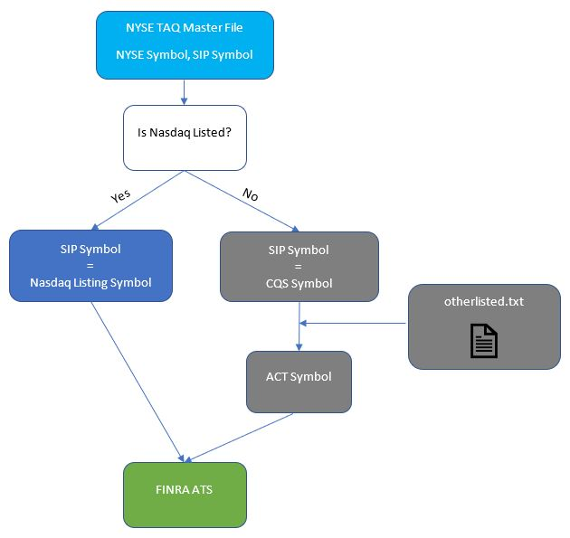

# Symbology in U.S. Equities Market

Sept 18, 2019

There are multiple symbology systems in the U.S. equities market and some of them are widely used in global financial markets. This article goes through each symbology system briefly and provides an example of how symbol conversion should be done properly with FINRA ATS data.

## Symbology in FIX
The following four symbology systems are supported by FIX Protocol. More info about FIX can be found [here](https://fiximate.fixtrading.org/index.html).

- **Tag 48**: Security ID
- **Tag 22**: Security ID Source

### RIC
A Reuters Instrument Code (RIC) is a ticker-like code used by Thomson Reuters to identify financial instruments and indices. For equities the codes were composed of a RIC Root (one to four characters – A through Z), followed by a period sign, then a one- or two-character (A through Z) code denoting the exchange on which the instrument is traded. Each company was meant to have a unique RIC root. Thus the RIC Root for International Business Machines would be IBM irrespective of the exchange on which International Business Machines was traded. Indexes have a leading period, for instance ``.DJI`` is the Dow Jones Industrial Average.

Some examples:

|   RIC    | NYSE Symbol |     Security Type |
|:--------:|:-----------:|------------------:|
|  XXXa.N  |    XXX A    |           Class A |
| XXX_w.N  |   XXX WI    |           Warrant |
| XXX_r.N  |   XXX RT    |             Right |
| XXX_pb.N |   XXX PRB   | Preferred Class B |

### ISIN
An International Securities Identification Number (ISIN) is a code that uniquely identifies a specific securities issue.

- An ISIN is a code that uniquely identifies a specific securities issue.
- The numbers are allocated by a country's respective national numbering agency (NNA). In the United States, it is the CUSIP Service Bureau.
- An ISIN is not the same as the ticker symbol, which identifies the stock at the exchange level. The ISIN is a number assigned to a security that is universally recognizable.
- ISINs are used for numerous reasons including clearing and settlement. The numbers ensure a consistent format so that holdings of institutional investors can be tracked consistent across markets worldwide.

ISIN codes have a total of 12 characters consisting of both letters and numbers.

- First two digits: the country in which the issuing company is headquartered (first two digits), along with a number specific to the security (middle nine digits), and a final character, which acts as a check. An example of an ISIN number for a US company’s stock certificate could look like this: US-000402625-0 (dashes incorporated for simplicity). On the other hand, a theoretical Namibian company could have an ISIN, which appears as NA-000K0VF05-4. The middle nine digits of the ISIN are computer-generated in a complex formula.

All internationally traded securities issuers are urged to use the ISIN numbering scheme, which is now the accepted standard by virtually all countries. The United States and Canada primarily use CUSIP number.

### CUSIP
CUSIP stands for Committee on Uniform Securities Identification Procedures.  A CUSIP number identifies most financial instruments, including: stocks of all registered U.S. and Canadian companies, commercial paper, and U.S. government and municipal bonds.  The CUSIP system (formally known as CUSIP Global Services)—owned by the American Bankers Association and managed by Standard & Poor’s—facilitates the clearance and settlement process of securities.

CUSIP numbers consist of nine characters (including letters and numbers) that uniquely identify a company or issuer and the type of financial instrument. The first six characters are known as the base, or CUSIP-6, and identify the bond issuer. The seventh and eighth digits identify the type of bond and the ninth digit is a “check digit” that is automatically generated.

### SEDOL

The description below is from [wiki](https://en.wikipedia.org/wiki/SEDOL).

SEDOL stands for Stock Exchange Daily Official List, a list of security identifiers used in the United Kingdom and Ireland for clearing purposes. The numbers are assigned by the London Stock Exchange, on request by the security issuer. SEDOLs serve as the National Securities Identifying Number for all securities issued in the United Kingdom and are therefore part of the security's ISIN as well.

SEDOLs are seven characters in length, consisting of two parts: a six-place alphanumeric code and a trailing check digit.[1] SEDOLs issued prior to January 26, 2004 were composed only of numbers. For older SEDOLs, those from Asia and Africa typically begin with 6. Those from the UK and Ireland (until Ireland joined the EU) typically begin with 0 or 3. Those from the rest of Europe typically began with 4, 5, or 7. Those from the Americas began with 2.

After January 26, 2004, SEDOLs were changed to be alpha-numeric and are issued sequentially, beginning with B000009. At each character position numbers precede letters and vowels are never used. All new SEDOLs, therefore, begin with a letter. Ranges beginning with 9 are reserved for end user allocation.

The check digit for a SEDOL is chosen to make the total weighted sum of all seven characters a multiple of 10. The check digit is computed using a weighted sum of the first six characters. Letters have the value of 9 plus their alphabet position, such that B = 11 and Z = 35. While vowels are never used in SEDOLs, they are not ignored when computing this weighted sum (e.g. H = 17 and J = 19, even though I is not used), simplifying code to compute this sum. The resulting string of numbers is then multiplied by the weighting factor as follows:

## Other Symbology

### Bloomberg Ticker
A Bloomberg ticker is a string of characters or numbers to identify a company or entity uniquely in Bloomberg. Equity Bloomberg ticker is made up of 3 parts:

1. Bloomberg ticker
1. Exchange code
1. Market Sector [Equity]

**Examples**:

- Singapore Airlines is ``SIA SP EQUITY``.
- IBM is ``IBM US EQUITY``.

Index Bloomberg ticker consists of:

1. Bloomberg ticker
1. Market Sector [Index]

**Example**: Hang Seng Index is ``HSI INDEX``.

### NASDAQ ACT
This symbology is for **reporting** and **clearing**. Automated Confirmation of Transactions (ACT), is a system for reporting and clearing trades in the over-the-counter (OTC) and NASDAQ securities markets. The Financial Industry Regulatory Authority (FINRA) also refers to NASDAQ ACT as the Trade Reporting Facility (TRF).

### NASDAQ Integrated Platform
This symbology is for **trading**. Initially, NASDAQ use the integrated platform symbology for non-Nasdaq listed names. From 2007 to 2010, Nasdaq migrated from fifth-character modifier symbology to the integrated platform suffix. More info about this migration can be found [here](http://www.nasdaqtrader.com/Trader.aspx?id=StockSymChanges).

CEBO (BATS, BATS Y, EDGEA, EDGEX) follows this symbology. The list of symbols traded is available [here](http://markets.cboe.com/us/equities/market_statistics/symbols_traded/?mkt=bzx).

### NYSE Symbol
NYSE provides Daily TAQ (Trade and Quote) which includes all trades and quotes for all issues traded on U.S. exchanges and off-markets. The Daily TAQ files also include the NBBO, Master file, Quote and Trade Admin Messages, and, CTA and UTP Admin Message files. Historical Data available as of 1993-present. Symbols in NYSE TAQ are expressed in NYSE Symbology, which consists of ``Root (6 chars maximum), space, and Suffix (10 chars maximum)``. See the [NYSE Symbology Specification](https://www.nyse.com/publicdocs/nyse/data/NYSE_Symbology_Spec_v1.0c.pdf) for details. The Master File also includes the symbols in the original formats published by the SIPs. For CTA symbols, see
[CTS Binary Output Specification](https://www.ctaplan.com/publicdocs/ctaplan/notifications/trader-update/CTS_BINARY_OUTPUT_SPECIFICATION.pdf) Appendix B. For UTP symbols, see [Nasdaq 5th Character Suffix List](https://www.nasdaqtrader.com/content/technicalsupport/specifications/dataproducts/nasdaqfifthcharactersuffixlist.pdf).

Some basic stats on the length of root and suffix in NYSE symbols over the first half year in 2019:

| listedExchange | nSymbols | minRootLength | maxRootLength | minSuffixLength | maxSuffixLength |
|:--------------:|:--------:|:-------------:|:-------------:|:---------------:|:---------------:|
|       A        |   330    |       2       |       4       |        0        |        4        |
|       N        |   3274   |       1       |       4       |        0        |        5        |
|       P        |   1667   |       2       |       4       |        0        |        0        |
|       Q        |   3644   |       1       |       4       |        0        |        1        |
|       V        |    1     |       4       |       4       |        0        |        0        |
|       Z        |   343    |       3       |       4       |        0        |        0        |

One example of NYSE symbol that has five chars in suffix is ``C PRLCL``, which is <b>Pr</b>eferred Class <b>L</b> <b>C</b>a<b>l</b>led.

### SIP Symbol
In NYSE TAQ, the "SIP Symbol" uses mixed symbology:

- For Nasdaq-listed securities, it is Nasdaq lising symbol
- For other regionally listed securities, it is CQS (Consolidated Quotation System) symbol

## FINRA ATS Data
FINRA made the ATS and non-ATS data available to public for free. It also provides an API to retrieve data from its database in January 2019. This data povides us a channel and the only channel to understand the liquidity distribution on off markets. To find the full liquidity distribution among all lit exchanges and dark pools, we need to marry FINRA ATS data with NYSE TAQ data. In this process, the first problem we need to solve is the symbol mapping.

<form name="finraTiers">
  <input type="radio" name="tier" value="t1" checked>Tier 1
  <input type="radio" name="tier" value="t2">Tier 2 
</form>

The Appendix A of [FINRA OTC Transparency API Specifications](https://www.finra.org/sites/default/files/OTC-Transparency-Data-File-Download-API-v04.pdf) provides some additional information on what symbology is used for ATS and non-ATS data reported to FINRA. Here is the Appendix A:

>> This section serves as a supplemental resource for security and symbol information provided by FINRA.
>> Reports are published using the NASDAQ assigned listing symbol for UTP securities and the NASDAQ ACT
>> symbol for Other Exchange Listed securities (NMS stocks). Other Exchange Listed security symbols may
>> contain a special character such as “.” or “$” to separate the root symbol from the suffix.

- [Daily list of Nasdaq listed symbols](http://www.nasdaqtrader.com/dynamic/SymDir/nasdaqlisted.txt)
- [Daily list of other listed symbols](http://www.nasdaqtrader.com/dynamic/SymDir/otherlisted.txt)
- [Ticker Symbol Convention](http://www.nasdaqtrader.com/trader.aspx?id=CQSsymbolconvention)

**Mapping between NYSE Symbol and FINRA Symbol**

## References
1. [NASDAQ ACT](https://en.wikipedia.org/wiki/ACT_(NASDAQ))
1. [CQS Symbol Conversion](https://www.nasdaqtrader.com/trader.aspx?id=CQSsymbolconvention)
1. [Reuters Instrument Code](https://en.wikipedia.org/wiki/Reuters_Instrument_Code)
